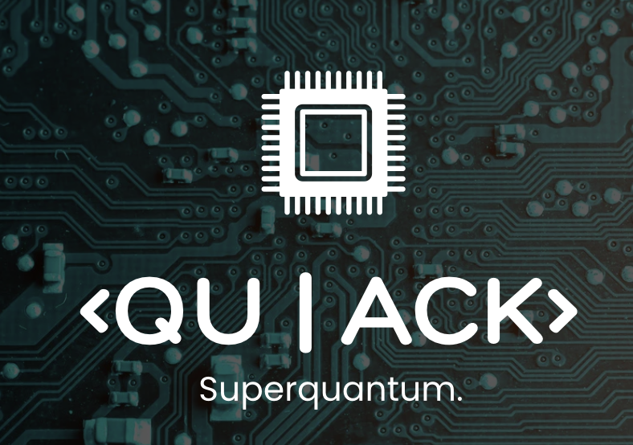

# iQuHACK 2026: Superquantum Challenge

**Clifford+T Compilation — Fault-Tolerant Quantum Circuits**

  
  <h3>Structure-Aware Quantum Compilation</h3>
  

    Built for <b>iQuHACK 2026 • Superquantum Track</b> 
    Compiling structured and random unitaries into 
    <b>low-cost Clifford+T circuits</b> for fault-tolerant quantum computing
  

  <a href="#about">About</a> • <a href="#approach">Approach</a> • <a href="#results">Results</a>

## About the Project

This project is our submission to the **Superquantum iQuHACK 2026 Challenge**, which focuses on one of the core bottlenecks in fault-tolerant quantum computing: the **high cost of non-Clifford (T) gates**. While ideal quantum algorithms are often expressed in terms of Hamiltonian evolution or high-level unitaries, real fault-tolerant implementations must be compiled into a restricted gate set `{S, S†, H, T, T†, CNOT}`, where T gates dominate physical resources. The challenge therefore emphasizes not only correctness, but **T-count minimization** and **operator-norm accuracy**.

Our goal is to compile a collection of **2-qubit and 4-qubit unitaries**—ranging from controlled gates and Hamiltonian exponentials to structured matrices and random unitaries—into efficient Clifford+T circuits. Rather than relying on brute-force synthesis or black-box optimizers, we focus on **understanding the mathematical structure of each unitary**, allowing us to design circuits that are both compact and interpretable. This mirrors real-world compiler design, where insight into symmetry, commutation, and algebraic form often leads to dramatic cost reductions.

## Approach

Our compilation strategy is **structure-first and physics-guided**. For each target unitary, we begin by identifying whether it can be expressed as an exponential of Pauli operators, decomposed into commuting terms, or transformed into a simpler form via Clifford conjugation. Hamiltonians such as `XX + YY`, `XX + YY + ZZ`, and transverse-field Ising models are handled analytically by exploiting known identities for Pauli exponentials and basis changes, allowing us to implement time evolution with minimal entangling depth and localized phase rotations. Controlled operations are reduced to diagonal or Z-controlled forms whenever possible, avoiding unnecessary overhead from naive control constructions.

Structured unitaries are treated as pattern-recognition problems rather than generic matrices. By identifying Fourier-like structure, tensor-product symmetries, or hidden block diagonality, we reuse previously optimized subcircuits instead of synthesizing each unitary from scratch. Arbitrary state preparation is approached by constructing a unitary that maps `|00⟩` to the target state, then selecting among equivalent constructions the one with the lowest T-count for a fixed accuracy. For the random unitary, we explicitly trade a small amount of operator-norm precision for a significant reduction in T gates, reflecting realistic fault-tolerant cost priorities.

The final 4-qubit diagonal unitary is implemented using **phase-polynomial reasoning**. By expressing the phase function φ(x) as a Boolean polynomial, we construct a Clifford+T circuit composed of phase gadgets and minimal CNOT scaffolding, avoiding ancilla-heavy or generic synthesis approaches. Throughout the project, we prioritize **exact or near-exact compilation** over high-depth approximations, keeping circuits shallow, interpretable, and resource-aware.

## Results & Evaluation

All circuits are submitted as **OpenQASM (v2/v3)** and strictly use the allowed gate set `{S, S†, H, T, T†, CNOT}`. Submissions are evaluated using two primary metrics: **operator norm distance** to the target unitary (up to global phase) and total **T-count**. Our solutions consistently emphasize low T-count while maintaining high fidelity, demonstrating how analytic insight and structural understanding can outperform naive synthesis even for small-qubit systems.

## Why This Matters

Fault-tolerant quantum computing will not be limited by abstract algorithms, but by **how efficiently we compile them**. This project highlights how careful reasoning about algebra, Hamiltonians, and Clifford structure leads to tangible resource savings. The techniques used here generalize beyond the challenge itself and are directly relevant to quantum simulation, arithmetic circuits, and near-term fault-tolerant architectures.

Built with care for **iQuHACK 2026 — Superquantum**.

## References

1. N. J. Ross and P. Selinger, *Optimal ancilla-free Clifford+T approximation of Z-rotations*, arXiv:1403.2975 (2014).

2. M. Amy and M. Mosca, *T-count optimization and Reed–Muller codes*, IEEE Transactions on Information Theory **65**, 4771–4784 (2019).

3. M. Amy, D. Maslov, and M. Mosca, *Polynomial-time T-depth optimization of Clifford+T circuits via matroid partitioning*, IEEE TCAD **33**, 1476–1489 (2014).

4. Superquantum, *rmsynth: High-performance Clifford+T circuit optimizer using phase-polynomial methods*, GitHub repository (2026).

5. P. Selinger, *Quantum circuits of T-depth one*, Physical Review A **87**, 042302 (2013).

6. F. Arute et al., *Quantum supremacy using a programmable superconducting processor*, Nature **574**, 505–510 (2019).

7. L. Susskind, *Complexity and Gravity*, Prospects in Theoretical Physics, IAS Lecture (2018).
